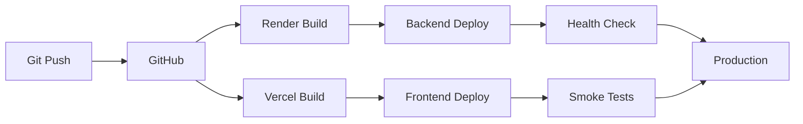

# Deployment Summary - MissionImpossible Full Stack

Complete deployment guide for the MissionImpossible application with backend on Render and frontend on Vercel.

## Architecture Overview

```
┌─────────────────────────────────────────────────────────────┐
│                     User Devices                            │
│  (Browser, Mobile PWA, Desktop PWA)                         │
└───────────────────────┬─────────────────────────────────────┘
                        │
                        ↓
┌─────────────────────────────────────────────────────────────┐
│              Vercel Edge Network (Global CDN)               │
│                    Frontend Deployment                       │
│  • Next.js 16.1.1 (App Router)                              │
│  • Static + Server Components                                │
│  • PWA with Service Workers                                  │
│  • Multi-language (EN/UR) + RTL                              │
│  • Voice Commands                                            │
└───────────────────────┬─────────────────────────────────────┘
                        │
                        ↓ HTTPS API Calls
┌─────────────────────────────────────────────────────────────┐
│                 Render Cloud Platform                        │
│                   Backend Deployment                         │
│  • FastAPI + Uvicorn                                         │
│  • SQLite Database                                           │
│  • CORS Configured                                           │
│  • Health Checks                                             │
│  • Auto-scaling                                              │
└─────────────────────────────────────────────────────────────┘
```

## Deployment Status

### ✅ Backend (Render)
- **Platform**: Render
- **Runtime**: Python 3.12
- **Framework**: FastAPI
- **Database**: SQLite (persistent volume)
- **Container**: Docker
- **Health Check**: `/health` endpoint
- **Documentation**: `backend/RENDER_DEPLOYMENT.md`

### ✅ Frontend (Vercel)
- **Platform**: Vercel
- **Framework**: Next.js 16.1.1
- **Build**: Turbopack
- **Deployment**: Automatic (main branch)
- **CDN**: Global Edge Network
- **Documentation**: `VERCEL_DEPLOYMENT.md`

## Quick Start Deployment

### 1. Deploy Backend First

```bash
cd backend
# Follow instructions in RENDER_DEPLOYMENT.md
# Get your backend URL: https://your-app.onrender.com
```

### 2. Deploy Frontend

```bash
cd frontend
# Update .env.local with backend URL
NEXT_PUBLIC_API_URL=https://your-app.onrender.com

# Follow instructions in VERCEL_DEPLOYMENT.md
# Get your frontend URL: https://your-app.vercel.app
```

### 3. Connect Services

Update backend environment variables in Render:
```bash
FRONTEND_URL=https://your-app.vercel.app
```

Redeploy backend to apply CORS settings.

## Environment Variables

### Backend (Render)

```bash
# Required
DATABASE_URL=sqlite:///./todos.db
FRONTEND_URL=https://your-app.vercel.app

# Optional
ENVIRONMENT=production
SECRET_KEY=<generated-secret-key>
PORT=8000
```

### Frontend (Vercel)

```bash
# Required
NEXT_PUBLIC_API_URL=https://your-app.onrender.com
NEXT_PUBLIC_APP_URL=https://your-app.vercel.app

# Optional
NEXT_PUBLIC_APP_NAME=MissionImpossible
NEXT_PUBLIC_ENABLE_VOICE_COMMANDS=true
NEXT_PUBLIC_ENABLE_MULTI_LANGUAGE=true
```

## Features Deployed

### Core Features
- ✅ Task Management (CRUD operations)
- ✅ User Authentication (Better Auth)
- ✅ Real-time Sync
- ✅ Offline Support (PWA)
- ✅ Multi-language (EN/UR)
- ✅ Voice Commands
- ✅ Touch Gestures

### Technical Features
- ✅ Server-Side Rendering (SSR)
- ✅ API Route Proxying
- ✅ Service Worker Caching
- ✅ Responsive Design
- ✅ RTL Layout Support
- ✅ Dark/Light Mode (future)

## Post-Deployment Checklist

### Backend Verification
- [ ] Health check responds: `curl https://your-app.onrender.com/health`
- [ ] API docs accessible: `https://your-app.onrender.com/docs`
- [ ] Database migrations applied
- [ ] CORS headers present in responses
- [ ] Environment variables set
- [ ] Logs show no errors

### Frontend Verification
- [ ] Homepage loads successfully
- [ ] Authentication flow works
- [ ] Tasks can be created/read/updated/deleted
- [ ] Language switcher (EN ↔ UR) works
- [ ] Voice commands prompt for mic permission
- [ ] PWA install prompt appears on mobile
- [ ] Offline mode works (service worker)
- [ ] API calls succeed (check network tab)

### Integration Testing
- [ ] Login from frontend connects to backend
- [ ] Task creation persists in backend database
- [ ] Language preference persists
- [ ] Voice commands trigger correct actions
- [ ] Offline changes sync when online

## Monitoring & Maintenance

### Render (Backend)
- Monitor via Render Dashboard
- Check logs: Render Dashboard → Logs
- Health checks run every 30 seconds
- Auto-deploys on git push to main

### Vercel (Frontend)
- Monitor via Vercel Dashboard
- Enable Vercel Analytics for metrics
- Check deployment logs
- Auto-deploys on git push to main

## Troubleshooting

### CORS Errors
**Symptom**: Frontend can't connect to backend API
**Solution**:
1. Verify `FRONTEND_URL` in backend matches your Vercel URL exactly
2. Check CORS middleware in `backend/main.py`
3. Ensure no trailing slashes in URLs

### Build Failures
**Backend**:
- Check Dockerfile syntax
- Verify all dependencies in `pyproject.toml`
- Check Python version compatibility

**Frontend**:
- Run `npm run type-check` locally
- Clear `.next` folder and rebuild
- Verify all dependencies in `package.json`

### Database Issues
**Symptom**: Tasks not persisting
**Solution**:
1. Check Render disk is mounted at `/data`
2. Verify `DATABASE_URL` points to `/data/todos.db`
3. Run migrations manually if needed

### Performance Issues
**Backend**:
- Check Render instance resources
- Upgrade instance type if needed
- Add database indexes

**Frontend**:
- Enable Vercel Edge Network
- Optimize images with next/image
- Review bundle size

## Scaling Considerations

### Backend (Render)
- **Free Tier**: Spins down after inactivity
- **Starter Tier**: Always on, better for production
- **Scale Up**: Increase RAM/CPU as needed
- **Database**: Consider PostgreSQL for production scale

### Frontend (Vercel)
- **Free Tier**: Suitable for small projects
- **Pro Tier**: Better analytics and support
- **Edge Functions**: Already distributed globally
- **No scaling needed**: Vercel handles it

## Security Best Practices

### Deployed
- ✅ HTTPS enforced on both platforms
- ✅ CORS restricted to frontend domain
- ✅ Environment variables secured
- ✅ SQL injection protection (SQLModel)
- ✅ XSS protection headers

### Recommended
- [ ] Add rate limiting to API
- [ ] Implement authentication tokens refresh
- [ ] Add request logging
- [ ] Set up error tracking (Sentry)
- [ ] Enable CSP headers

## Cost Estimates

### Free Tier Usage
- **Render**: 750 hours/month free
- **Vercel**: 100GB bandwidth free, unlimited requests
- **Total**: $0/month for low traffic

### Paid Tier (Production)
- **Render Starter**: $7/month (always-on)
- **Vercel Pro**: $20/month (better limits)
- **Total**: ~$27/month

## Backup & Recovery

### Backend Database
```bash
# Backup SQLite database
scp render-user@your-app:/data/todos.db ./backup.db

# Restore
scp ./backup.db render-user@your-app:/data/todos.db
```

### Rollback Deployments
- **Render**: Rollback via Dashboard → Deployments
- **Vercel**: Promote previous deployment to production

## Support & Resources

### Documentation
- Backend: `backend/RENDER_DEPLOYMENT.md`
- Frontend: `VERCEL_DEPLOYMENT.md`
- Database: `docs/database-setup.md`

### Platform Docs
- [Render Documentation](https://render.com/docs)
- [Vercel Documentation](https://vercel.com/docs)
- [FastAPI Documentation](https://fastapi.tiangolo.com)
- [Next.js Documentation](https://nextjs.org/docs)

### Community
- [Render Community](https://community.render.com)
- [Vercel Community](https://github.com/vercel/vercel/discussions)

## Next Steps

1. **Custom Domains**: Configure custom domains on both platforms
2. **Analytics**: Enable analytics on Vercel
3. **Error Tracking**: Set up Sentry or similar
4. **Monitoring**: Add uptime monitoring (UptimeRobot)
5. **CI/CD**: Add automated testing before deployment
6. **Database**: Migrate to PostgreSQL for production
7. **Caching**: Add Redis for session management

## Deployment Workflow



## Success Criteria

- ✅ Both services deployed and accessible
- ✅ Frontend can communicate with backend
- ✅ Authentication works end-to-end
- ✅ Tasks can be managed through UI
- ✅ PWA installable on mobile devices
- ✅ Multi-language support functional
- ✅ Voice commands working (with permissions)
- ✅ Offline mode functional
- ✅ No console errors in production
- ✅ Performance acceptable (< 3s initial load)

